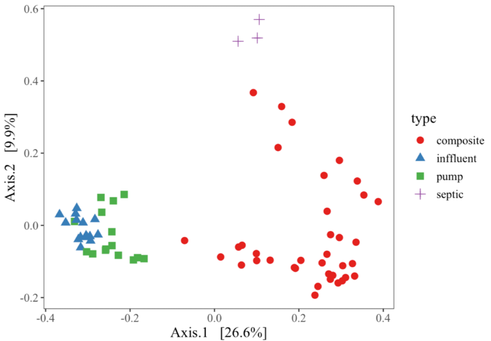
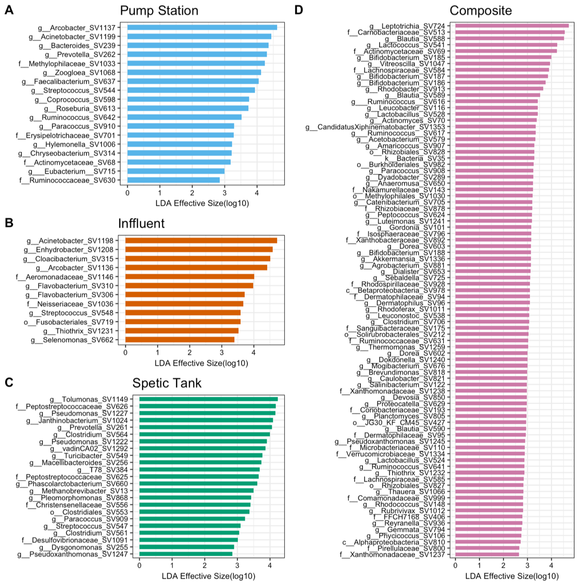

### 40 sewage samples in 2018 + 30 influent samples in 2019 + 6 septic tank samples in 2019
- **Bioinformatic analysis in QIIME2**
- **Differential abundance analysis**
It needs a special format of table. Need QIIME1, so 
conda actiavate py27 (qiime1 needs py27)
conda install -c bioconda qiime 

> summarize_taxa.py -i otu_table_json.biom -o summarize_taxa_L6 -m meta_March.txt --delimiter '|'

Then on mac, transpose the table
### Analysis the sample type differences by PCoA with unifrac distance, result shows that 

### Differential abundance analysis
- Step 1: the Kruskall-Wallis test analyzes all features, testing whether the values in different classes are differentially distributed.  
- Step 2: the pairwise Wilcoxon test checks whether all pairwise comparisons between subclasses within different classes significantly agree with the class level trend.
- Step 3: the resulting subset of vectors is used to build a Linear Discriminant Analysis model

Result show that 

